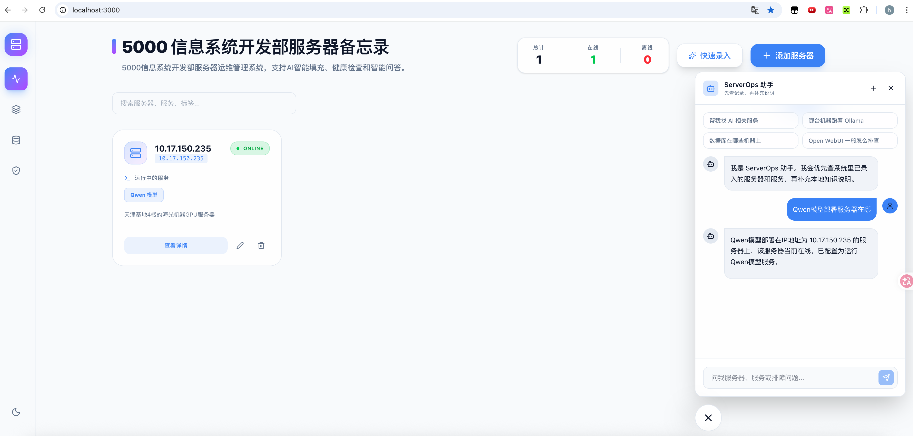

# ServerOps Memo

> 服务器运维管理系统

## 解决什么问题

当你需要管理多台服务器时，是否遇到以下困扰：

- 记录了服务器 IP 和密码，时间久了找不到
- 想知道哪些服务部署在哪台服务器上，需要翻文档
- 服务器或服务挂了，需要登录服务器才能发现
- 团队成员不知道有哪些服务器可用

ServerOps Memo 可以帮你解决这些问题。

## 功能特性

### 1. 集中管理服务器信息
- 记录服务器 IP、SSH 账号密码
- 按标签分类管理
- 支持别名搜索

### 2. 服务运行状态监控
- 自动检查服务器 SSH 端口连通性
- 检查服务健康检查 URL（HTTP 200 = 正常）
- 每 5 分钟自动检查，状态实时显示

### 3. AI 智能录入
- 用自然语言描述服务器信息
- AI 自动提取：IP、用户名、密码、服务名称
- 示例：`192.168.1.100，用户名 root，密码 abc123，运行 Nginx`

### 4. AI 问答助手
- 问：Docker 在哪台服务器上？
- 问：有哪些服务器？
- 自动关联服务器记录和知识库文档

## 快速开始

### 后端

```bash
cd backend
pip install -r requirements.txt
uvicorn backend.main:app --reload --port 8889
```

### 前端

```bash
cd frontend
npm install
echo "VITE_API_BASE_URL=http://127.0.0.1:8889" > .env.local
npm run dev
```

访问 http://localhost:5173

## 技术栈

- 后端：FastAPI + SQLite
- 前端：React + TypeScript + Tailwind CSS
- AI：Qwen3 (本地部署)

## 环境变量

| 变量 | 默认值 | 说明 |
|------|--------|------|
| `SERVEROPS_AI_URL` | `http://10.17.150.235:8000/v1` | AI 服务地址 |

## API

| 方法 | 路径 | 说明 |
|------|------|------|
| GET | `/api/servers` | 获取服务器列表 |
| POST | `/api/servers` | 创建服务器 |
| PUT | `/api/servers/{id}` | 更新服务器 |
| DELETE | `/api/servers/{id}` | 删除服务器 |
| POST | `/api/assistant/query` | AI 问答 |
| POST | `/api/ai/extract-server` | AI 提取服务器信息 |